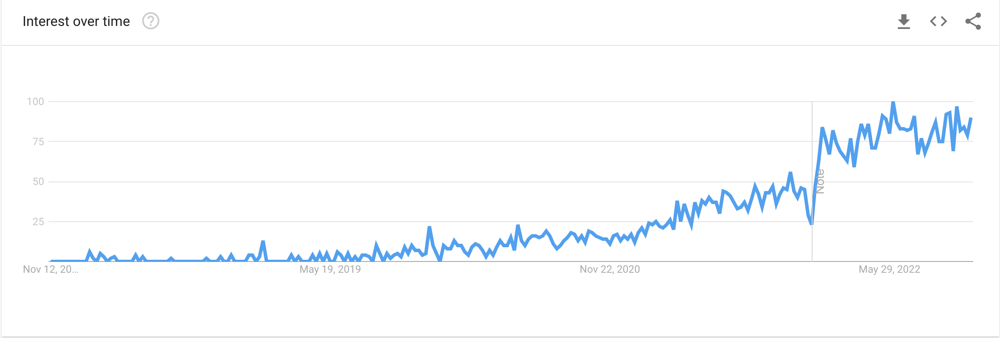

# 00. Introduction
## Introduction

2022년 MLOps 에 대한 관심은 폭발적으로 증가했습니다. [그림 0-1] 은 “MLOps” 키워드에 대한 구글 트랜드 그래프입니다. 2022년을 기점으로 검색량이 폭발적으로 증가한 것을 확인할 수 있습니다.

[그림 0-1] MLOps Google Trend

이런 관심의 집중에 따라 MLOps에 관한 많은 포스팅 글들을 찾아볼 수 있습니다. 하지만 대부분은 MLOps 의 개념에 관해서만 다루고 있습니다.
또한, MLOps는 그 자체로 제품 혹은 플랫폼이 될 정도로 방대한 범위를 다루고 있습니다. 대표적인 클라우드 회사에서는 SageMaker(AWS), VertexAI (Google Cloud) 과 같이 MLOps 제품을 출시했습니다.

그런데 정작 이를 사용해야 하는 머신러닝 엔지니어 입장에서는 “그래서 어떻게 MLOps 를 할 수 있는 건데?” 라는 의문이 들 수 밖에 없습니다.
이러한 의문을 조금이라도 풀 수 있도록  “머신러닝 엔지니어를 위한 MLOps”를 집필하였습니다.

## 다루는 내용

[그림 0-2]는 MLOps를 설명할 때 많이 쓰이는 구글 클라우드에서 제시한 MLOps의 0단계 입니다. MLOps의 목표는 0단계를 자동화시키는 것과 모델 개발 환경과 모델 운영 환경을 일치시키는 것에 있습니다.

[그림 0-2] MLOps Level 0

“머신러닝 엔지니어를 위한 MLOps” 에서는 직접 구현해보며 각 컴포넌트들이 어떤 역할을 하는지 컴포넌트끼리는 어떻게 연결해야 하는지 설명하고자 합니다. 여기서 다루는 내용을 간단히 도식화 하면 [그림 0-3]과 같이 표시할 수 있습니다.

[그림 0-3] Pipeline

도표에 표시되어 있는 컴포넌트들에 대한 내용은 다음 챕터에서 다룹니다.

| 컴포넌트 | 챕터 |
| --- | --- |
| Chapter 1 | Database 구축 |
| Chapter 2 | Model Development Pipeline 작성 |
| Chapter 3 | Model Registry 구축 |
| Chapter 6 | Model Deployment |
| Chapter 8 | Stream |

각 컴포넌트를 구현하는데 사용하는 패키지 및 소프트웨어는 다음의 기준으로 선정하였습니다.

1. 오픈소스일 것
2. 공식 Documentation 에 자세한 설명이 나와 있으며 관리가 되고 있을 것

대표적으로 사용하는 패키지는 FastAPI, sqlalchemy, mlflow 등이 있습니다.
단순히 따라해보는 것에 그치지 않고 본인의 업무에 필요한 방향으로 적용해 볼 수 있도록 간단한 튜토리얼을 작성하고 MLOps에 맞게 변형하는 과정으로 진행됩니다.

## 이 문서를 학습하는 방법

“머신러닝 엔지니어를 위한 MLOps” 는 모든 컴포넌트들을 Docker로 실행됩니다. 머신러닝의 성능 재현은 머신러닝 모델을 다룰 때 가장 중요한 부분 중 하나입니다. 이를 위해서는 OS, 파이썬 버전, 패키지 버전, 코드, 가중치 등 모델을 학습 했을 때의 환경과 모든 것이 동일해야 합니다. 이런 동일한 환경을 제공하기 위해서  Containerization 은 머신러닝에서 중요한 기술 중 하나이며 이를 대표하는 소프트웨어가 바로 Docker 입니다. 이러한 배경으로 머신러닝 엔지니어에게 Docker를 이해하고 다룰 수 있어야 합니다. 머신러닝 엔지니어에게 필요한 수준의 docker를 다루고 이해할 수 있게하기 위해서 본 문서에서는 로컬 환경에서 실행되는 스크립트 작성 후 이를 docker에서도 실행할 수 있는 순서로 진행됩니다.

본 문서에서는 모든 장을 시작하기에 앞서 “목표" 및 "스펙 명세서" 항목을 작성했습니다.  예를 들어서 다음 챕터의 첫번째 장에서 다루게 될 목표는 다음과 같습니다.

---
1. Docker 를 이용해 postgres server 를 생성합니다.
2. 생성된 DB 의 role name 과 attributes 를 확인합니다.
---

그리고 목표 달성을 위한 스펙 명세서는 다음과 같습니다.

---
1. Docker 를 설치합니다.
2. Postgres 서버를 생성합니다.
    - `POSTGRES_USER` : `myuser`
    - `POSTGRES_PASSWORD` : `mypassword`
    - `POSTGRES_DB` : `mydatabase`
    - `Port forwarding` : `5432:5432`
3. 생성된 postgres 서버를 확인합니다.
    - `psql` 로 DB 에 접근하여 role name 과 attributes 확인
---

이 후에는 해당 내용에 대한 부분을 설명합니다.

좀 더 효율적인 학습을 위해서는 스펙 명세서만 보고 나서 직접 구현한 뒤 설명하는 내용들을 읽는다면 좋을 것 같습니다.
