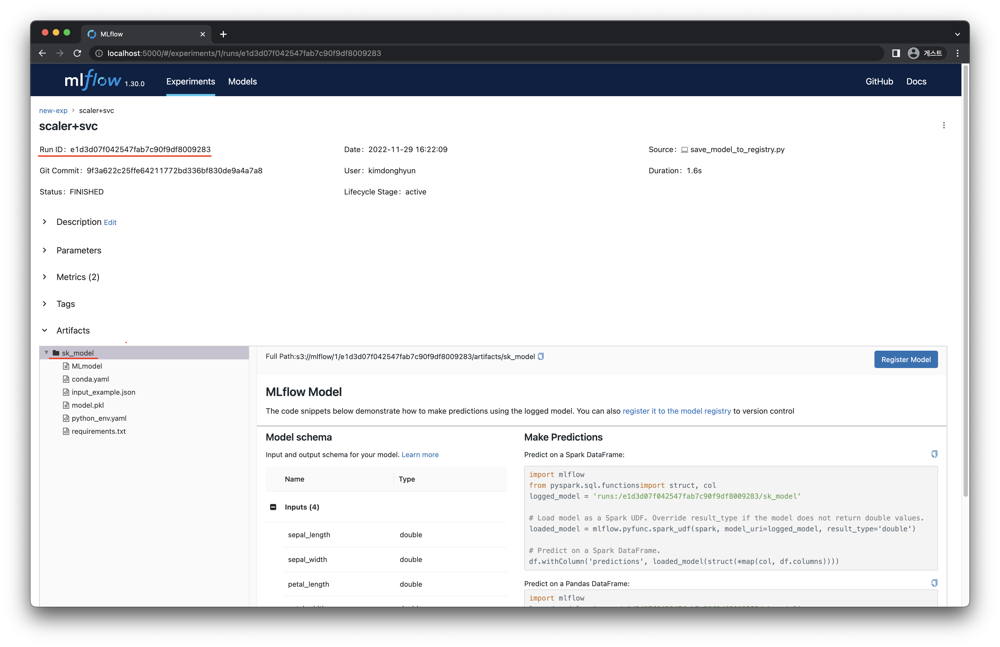
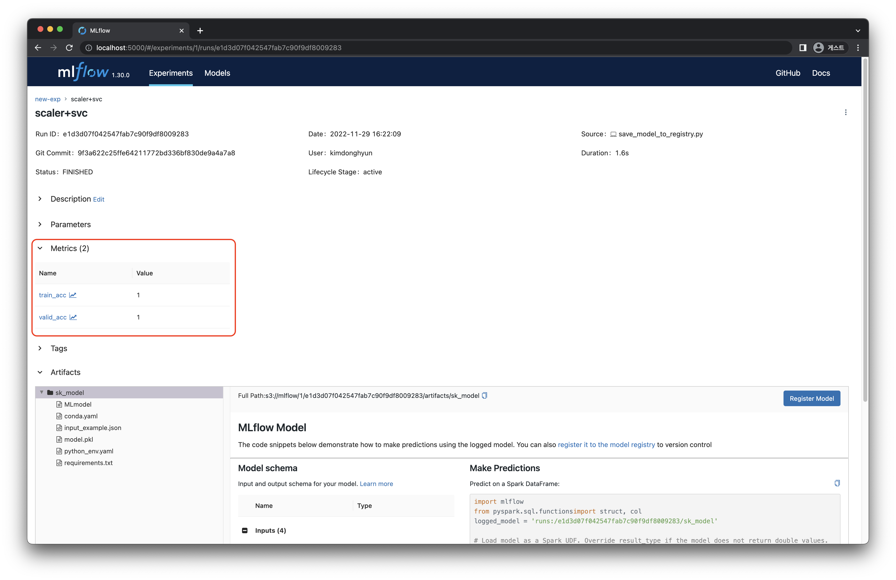

# 3) Load Model from registry
## 목표

1. mlflow 에 저장된 모델을 불러올 수 있는 스크립트를 작성합니다.
2. 불러온 모델을 통해 추론하고 결과를 확인합니다.

## 스펙 명세서

1. 학습이 끝난 모델을 mlflow built-in method 를 사용해 mlflow server 에서 불러옵니다.
    - Python 의 `mlflow` 패키지를 이용합니다.
        - `pip install mlflow`
    - 학습에 관련된 정보가 저장 되어있는 `run` 의 `run_id` 를 사용해 모델을 불러옵니다.
    - `mlflow` 를 활용해 모델을 불러오는 방법은 두 가지가 있습니다.
        1. [MLFlow built-in Model Flavors](https://www.mlflow.org/docs/latest/models.html#built-in-model-flavors)
        2. [MLFLow pyfunc load_model](https://mlflow.org/docs/latest/python_api/mlflow.pyfunc.html#mlflow.pyfunc.load_model)
    - 이번 장에서는 `sklearn` 의 모델을 불러오기 위해 `mlflow.sklean.load_model` 을 사용합니다.
2. 불러온 모델을 활용해 저장해두었던 학습 데이터의 결과를 추론합니다.

<div style={{textAlign: 'center'}}>


[그림 3-9] MLflow Model Load Diagram
</div>


---

## 1.  모델 불러오기

앞 장에서 작성한 코드로 학습된 모델을 서버로 부터 로드하는 코드를 작성합니다.

### 1.1 환경 변수 설정

앞 장과 같이 mlflow 에 접근하기 위한 환경 변수를 설정합니다.

```python
import os

os.environ["MLFLOW_S3_ENDPOINT_URL"] = "http://localhost:9000"
os.environ["MLFLOW_TRACKING_URI"] = "http://localhost:5001"
os.environ["AWS_ACCESS_KEY_ID"] = "minio"
os.environ["AWS_SECRET_ACCESS_KEY"] = "miniostorage"
```

### 1.2 모델 불러오기

#### 1.2.1 `sklearn` 모델 불러오기

앞 장에서 저장했던 모델을 불러오기 위해, `mlflow.sklearn.load_model` 함수를 사용해 저장된 모델을 불러옵니다. 모델을 포함하고 있는 `run_id` 와 모델을 저장 할 때 설정했던 모델 이름을 받을 수 있도록 외부 변수를 설정합니다.

```python
parser = ArgumentParser()
parser.add_argument("--run-id", dest="run_id", type=str)
parser.add_argument("--model-name", dest="model_name", type=str, default="sk_model")
args = parser.parse_args()
```

앞서 받은 두 가지 변수를 `mlflow.sklearn.load_model` 의 인자에 매핑하여 모델을 로드합니다.

```python
model_pipeline = mlflow.sklearn.load_model(f"runs:/{args.run_id}/{args.model_name}")
```

불러와진 모델을 확인하면 아래와 같습니다.

```python
print(model_pipeline)
# Pipeline(steps=[('scaler', StandardScaler()), ('svc', SVC())])
```

#### 1.2.2 `pyfunc` 모델 불러오기

`mlflow` 에서는 지정한 방식[[MLFlow Storage Format](https://www.mlflow.org/docs/latest/models.html#storage-format)]에 따라 저장 되어있는 모델에 대해서는 종류에 관계없이 `mlflow.pyfunc.load_model` 을 이용해 쉽게 모델을 불러올 수 있습니다.

이 때 로드된 모델은 기존의 클래스가 아닌 `mlflow.pyfunc.PyFuncModel` 클래스로 불러와집니다. `PyFuncModel` 이란 `mlflow` 에서 정의된 새로운 클래스로, 결과 추론을 위해 학습한 모델의 `predict` method 를 호출하도록 wrapping 된 클래스입니다.

```python
model_pipeline = mlflow.pyfunc.load_model(f"runs:/{args.run_id}/{args.model_name}")
```

마찬가지로 앞서 받은 두 가지 변수를 `mlflow.pyfunc.load_model` 의 인자에 매핑하여 모델을 로드합니다.

불러와진 모델을 확인하면 아래와 같습니다.

```python
print(model_pipeline)
# mlflow.pyfunc.loaded_model:
#   artifact_path: sk_model
#   flavor: mlflow.sklearn
#   run_id: `RUN_ID`
```

### 1.3 추론 코드 작성하기

앞 장에서 저장했던 데이터인 `data.csv` 파일로 부터 데이터를 불러옵니다.

```python
df = pd.read_csv("data.csv")
```

학습 조건과 같도록 데이터를 할당 하고, 학습 데이터 / 평가 데이터로 분할 해줍니다.

```python
X = df.drop(["id", "target"], axis="columns")
y = df["target"]
X_train, X_valid, y_train, y_valid = train_test_split(X, y, train_size=0.8, random_state=2022)
```

`02. Model Development` 챕터와 같이 결과를 계산 하고 출력합니다.

```python
train_pred = model_pipeline.predict(X_train)
valid_pred = model_pipeline.predict(X_valid)

train_acc = accuracy_score(y_true=y_train, y_pred=train_pred)
valid_acc = accuracy_score(y_true=y_valid, y_pred=valid_pred)

print("Train Accuracy :", train_acc)
print("Valid Accuracy :", valid_acc)
# Train Accuracy : 0.95
# Valid Accuracy : 0.95
```

## 2. 전체 코드 완성

추가 작성한 코드를 전체 코드에 적용하여 완성합니다.

### 2.1 `download_model_from_registry.py`

```python
# download_model.py
import os
from argparse import ArgumentParser

import mlflow
import pandas as pd
from sklearn.metrics import accuracy_score
from sklearn.model_selection import train_test_split

# 0. set mlflow environments
os.environ["MLFLOW_S3_ENDPOINT_URL"] = "http://localhost:9000"
os.environ["MLFLOW_TRACKING_URI"] = "http://localhost:5001"
os.environ["AWS_ACCESS_KEY_ID"] = "minio"
os.environ["AWS_SECRET_ACCESS_KEY"] = "miniostorage"

# 1. load model from mlflow
parser = ArgumentParser()
parser.add_argument("--model-name", dest="model_name", type=str, default="sk_model")
parser.add_argument("--run-id", dest="run_id", type=str)
args = parser.parse_args()

model_pipeline = mlflow.pyfunc.load_model(f"runs:/{args.run_id}/{args.model_name}")

# 2. get data
df = pd.read_csv("data.csv")

X = df.drop(["id", "target"], axis="columns")
y = df["target"]
X_train, X_valid, y_train, y_valid = train_test_split(X, y, train_size=0.8, random_state=2022)

# 3. predict results
train_pred = model_pipeline.predict(X_train)
valid_pred = model_pipeline.predict(X_valid)

train_acc = accuracy_score(y_true=y_train, y_pred=train_pred)
valid_acc = accuracy_score(y_true=y_valid, y_pred=valid_pred)

print("Train Accuracy :", train_acc)
print("Valid Accuracy :", valid_acc)
```

### 2.2 실행 및 결과 확인

1. [localhost:5001](http://localhost:5001) 에 접속하여 저장된 모델의 `run` 을 클릭하여 `run_id` 와 `model_name` 를 확인합니다.
    <div style={{textAlign: 'center'}}>

    
    [그림 3-10] `run-id` 및 `model-name` 확인
    </div>    
2. 아래 코드의 `--model-name` , `--run-id` 뒤에 해당 값을 사용해 실행합니다.
    
    ```bash
    $ python download_model.py --model-name sk_model --run-id `RUN_ID`
    ```
    
3. MLflow server 의 metrics 를 확인하여 학습 했던 결과와 같은지 확인합니다.
    <div style={{textAlign: 'center'}}>

    
    [그림 3-11] 모델 추론 결과 확인
    </div>
